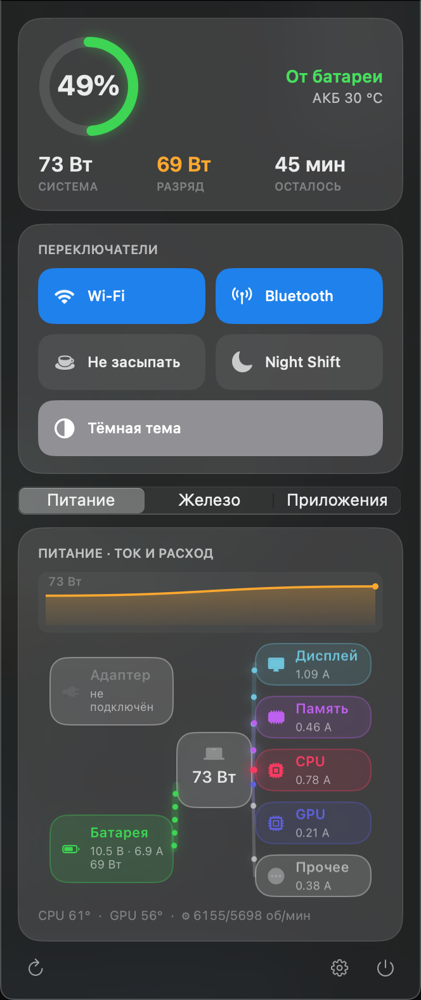

# Kelvin

Kelvin — утилита для строки меню macOS: мониторинг батареи и системы,
управление охлаждением и зарядом, сетевые инструменты и переключение раскладки.
Все функции доступны бесплатно, без аккаунта и активации.



## Возможности

- Заряд, здоровье, циклы и температура батареи, расход энергии и графики.
- Схема потоков энергии между адаптером, батареей и компонентами системы.
- Нагрузка CPU/GPU, память, диски, сеть и энергопотребление приложений.
- Профили вентиляторов, лимит заряда и температурные уведомления.
- Автоматическое переключение раскладки и исправление набранного текста.
- Сетевые подключения, блокировка хостов и системные переключатели.

Доступность датчиков и управления зависит от модели Mac. Для неизвестных моделей
датчики без подтверждённого назначения отображаются как сырые данные.
Управление вентиляторами и зарядом, а также чтение `powermetrics` требуют
установки соответствующего хелпера с правами администратора.

Мониторинг работает локально. Проверка обновлений обращается к серверу;
отправку отчётов о сбоях пользователь включает отдельно.
Подробнее: [политика отчётов о сбоях](docs/crash-reporting-policy.md).

## Сборка и запуск

Целевая система — macOS 11 и новее, Intel и Apple Silicon.
Для сборки нужны инструменты Swift из Xcode Command Line Tools.
`Sparkle.framework` и утилиты Sparkle в `bin/` включены в репозиторий.

```sh
xcode-select --install  # если Command Line Tools ещё не установлены
./build.sh
open Kelvin.app
```

`build.sh` собирает универсальное приложение для `x86_64` и `arm64`, включая
хелперы, и подписывает его локальной ad-hoc подписью.

Чтобы установить сборку в `/Applications`:

```sh
./install-app.sh
```

Автозапуск настраивается в приложении. Для удаления сначала отключите установленные
хелперы в настройках, затем выполните `./uninstall-app.sh`.

## Разработка

```sh
./typecheck.sh       # проверка типов для текущей архитектуры
./test/run-tests.sh  # тесты логики и полноты переводов
```

Основные каталоги:

| Каталог | Содержимое |
| --- | --- |
| `Sources/` | Приложение на Swift, AppKit и SwiftUI |
| `helper/` | Системные службы и установщики |
| `test/` | Тесты логики, локализации и фикстуры датчиков |
| `Resources/` | Иконки, оформление DMG и офлайн-базы GeoIP |
| `tools/` | Генерация ресурсов и вспомогательные инструменты |
| `docs/` | Сайт, заметки к выпускам и техническая документация |

Диагностические переменные для локальной сборки:

- `BM_DUMP=1` — вывести показатели в консоль и завершить работу.
- `BM_SHOWCASE=1` — открыть интерфейс в отдельном окне.
- `BM_AUTOSHOW=1` — открыть поповер при запуске.
- `BM_POWERFILE=/path/to/power.txt` — использовать сохранённый вывод хелпера.
- `BM_SMCPROBE=1` — диагностика датчиков и охлаждения.
- `BM_LANGTEST=1` — диагностика раскладок и разрешений Accessibility.

Пример: `BM_SMCPROBE=1 ./Kelvin.app/Contents/MacOS/Kelvin`.

## Выпуски и обратная связь

- [Сборка и публикация релиза](RELEASE.md)
- [Ручная проверка перед выпуском](QA.md)
- [Диагностика обновлений](UPDATE_RUNBOOK.md)

При сообщении об ошибке укажите версию Kelvin, версию macOS, модель Mac и шаги
воспроизведения. Перед публикацией диагностического отчёта проверьте его содержимое.

Уведомления о стороннем коде находятся в `THIRD_PARTY_NOTICES/`.
